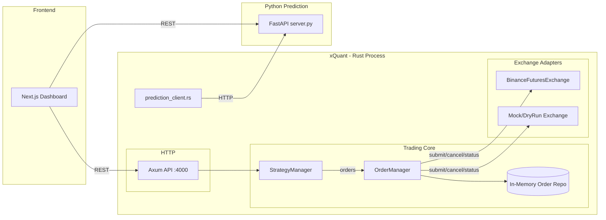
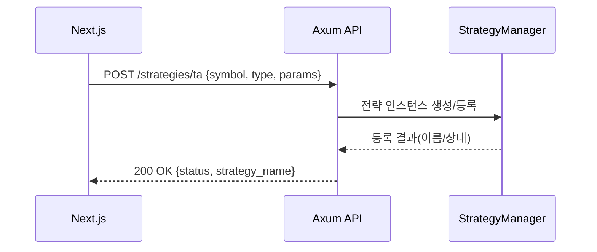

## xQuant 아키텍처

이 문서는 xQuant 모노레포의 구성요소와, 각 구성요소가 런타임에서 어떻게 상호작용하는지를 설명합니다.

### 전체 구성 개요
- **Rust 트레이딩 엔진(`src/`)**: 시스템의 핵심. 전략이 주문을 생성하고, 매니저가 오케스트레이션하며, 거래소 커넥터가 실행합니다.
- **HTTP API(Axum, `src/http/*`, 포트 4000)**: 대시보드/외부 연동을 위한 단일 HTTP 인터페이스.
- **프론트엔드(`quant_front/`)**: Next.js + Tailwind 대시보드. Axum 및 Python API를 호출.
- **Python 예측(`python_prediction/`)**: FastAPI 서비스. 지표/시그널/백테스트/ML(플레이스홀더) 제공.

---

## Rust 트레이딩 엔진 (src/)

### 핵심 데이터 모델(`src/models/*`)
- **`order.rs`**: `Order`, `OrderId`, `OrderType`, `OrderSide`, 선물 옵션(`reduce_only`, `position_side`).
- **`trade.rs`**, **`market_data.rs`**, **`position.rs`**: 체결/시가정보 스냅샷/포지션.

### 전략 계층(`src/strategies/*`)
- **Trait `Strategy`**: `name`, `on_market_data`, `generate_orders` 제공.
- 기본 전략: `vwap.rs`, `twap.rs`, `iceberg.rs`, `trailing_stop.rs`, `technical.rs`, `combined.rs`.
- 각 전략 인스턴스는 내부 상태를 유지하며 `MarketData`를 받아 0개 이상의 `Order`를 산출합니다.

### 오케스트레이션
- **`core/strategy_manager.rs`**: 활성 전략들을 보유/업데이트하고 주문을 수집.
- **`order_core/manager.rs`**: 주문을 `Exchange`로 제출. 재시도 및 오류코드 인지 백오프 내장.
  - 시간 드리프트(예: `-1021`) → `Exchange::sync_time()` 호출 후 재시도.
  - 레이트리밋(HTTP 429) → 백오프 확대.
- **`order_core/repository.rs`**: 주문 저장(In-memory, 임시).

### 시세/마켓 데이터
- **`market_data/provider.rs`**, `stream.rs`: 폴링/스트리밍 추상화(WebSocket 연동 예정).
- 현재 라이브 루프는 커넥터의 REST 스냅샷(예: `bookTicker`)로 미드프라이스를 주기적으로 폴링합니다.

### 거래소 커넥터(`src/exchange/*`)
- **`traits.rs`**: `Exchange` 트레이트. 주문 제출/취소/상태, 마켓데이터 스냅샷, 선물 설정, `sync_time` 등.
- **`binance_futures.rs`**: USDT-M 선물 REST 커넥터(미니멀):
  - 주문 전 `exchangeInfo` 필터(`tickSize`/`stepSize`/`minQty`/`minNotional`) 적용.
  - 레버리지/포지션모드/마진모드/서버시간 동기화/미드프라이스(책틱커) 지원.
  - 원자적 스로틀링으로 과도한 호출 방지.
- **`mocks.rs`**: 테스트용 모의 구현.
- **`dry_run.rs`**: 사이드이펙트 없이 로그만 남기는 드라이런 구현.

### 라이브 트레이딩 런타임 (`src/main.rs` 내부)
- `Config.exchange.use_mock` 및 환경변수에 따라 거래소 선택.
- 시작 시 선물 기본값(레버리지/포지션모드/마진모드) 적용 가능.
- 심볼별 주기 작업:
  1) `Exchange`에서 `MarketData`(미드프라이스) 조회
  2) `StrategyManager`가 전략 업데이트
  3) 생성된 주문 수집
  4) `OrderManager`가 재시도 로직과 함께 제출

### 설정/구성(`src/config.rs`, `Config.json`)
- 파일 기반 설정 + 환경변수 오버라이드: `EXCHANGE_API_KEY`, `EXCHANGE_API_SECRET`, `EXCHANGE_BASE_URL`, `USE_MOCK`, `API_TOKEN`.
- 선택적 선물 기본값: `symbols`, `leverage`, `isolated`, `hedge`.

### 오류 처리/회복탄력성
- `OrderManager`에서 중앙 집중 재시도(오류코드 인지).
- `Exchange::sync_time`으로 타임스탬프 드리프트 보정.
- 커넥터 레벨 스로틀링으로 레이트리밋 준수.

---

## HTTP 계층 (Axum 단일화)

### Axum API (`src/http/mod.rs`)
- 목적: 대시보드/운영을 위한 단일 HTTP 표면.
- 현재 제공:
  - `GET /health`: `{ status: "ok" }`
  - `GET /strategies`: `StrategyManager`의 `(전략명, 활성여부)` 목록
  - `POST /strategies/ta`: 기본 Technical 전략 생성(MA 교차, RSI 등) 파라미터 수용
- `tower-http` CORS 활성화로 프론트 호출 허용.
- 트레이딩 엔진과 같은 프로세스에서 구동되며, `Arc<RwLock<...>>`로 상태 공유.

### 포트
- Axum: `127.0.0.1:4000`

---

## 프론트엔드 (`quant_front/`)
- Next.js(App Router) + Tailwind 기반 대시보드.
- 주로 Axum API(4000 포트)를 호출하며, 필요 시 Python 예측 API 호출로 확장.
- 초기 페이지 구성:
  - 헬스 위젯(`GET /health`)
  - 전략 목록(`GET /strategies`)

---

## Python 예측 서비스 (`python_prediction/`)
- FastAPI 서버(`api/server.py`).
- 기능:
  - OHLCV 수집 및 지표 계산
  - 여러 전략의 시그널 생성(트렌드 추종/미신/MACD+StochRSI/볼린저 밴드)
  - 백테스트 수행(기본 성과지표 반환)
  - 예측 엔드포인트(현재는 간이 로직, 향후 ML 모델 대체)
- Rust(`prediction_client.rs`)나 프론트에서 직접 호출 가능.
- CORS 활성화. `uvicorn`으로 구동. 호스트/포트는 Python 설정(`config.api`) 사용.

---

## 전형적인 흐름 시나리오

### 1) 실거래 루프
1. 거래소 커넥터가 최신 가격(현재는 REST 폴링)을 가져옵니다.
2. `StrategyManager`가 각 활성 `Strategy`에 `MarketData`를 공급합니다.
3. 전략은 내부 상태를 갱신하고 필요한 `Order`를 제안합니다.
4. `OrderManager`가 검증 후 `Exchange`로 제출합니다(재시도/백오프 내장).
5. 거래소 응답(`OrderId`/상태)을 인메모리 저장소에 반영합니다.
6. HTTP API를 통해 상태를 UI/외부 클라이언트로 제공합니다.

### 2) UI에서 Technical 전략 생성
1. 프론트엔드가 Axum `/strategies/ta`에 `{ symbol, strategy_type, params }`로 POST합니다.
2. Axum 핸들러가 `Strategy`를 구성하고 `StrategyManager`에 등록합니다.
3. 라이브 루프의 다음 틱에서 전략이 활성화되어 조건 충족 시 주문을 생성합니다.

### 3) 선물 설정 변경
1. 클라이언트가 Warp `/futures/settings`(또는 개별 엔드포인트)에 레버리지/마진/포지션 모드로 POST합니다.
2. 핸들러가 `Exchange` 트레이트의 대응 메서드를 호출합니다.
3. 바이낸스 커넥터는 REST 엔드포인트를 호출하고 필요 시 클라이언트 상태를 갱신합니다.

### 4) Python 시그널/백테스트 사용
1. 프론트(또는 Rust)가 FastAPI `/signals` 또는 `/backtest`를 호출합니다.
2. Python 서비스가 데이터를 조립/지표 계산/전략 시그널 생성 후 JSON으로 응답합니다.
3. Rust는 결과를 수용하여 전략 파라미터 조정 또는 모니터링에 활용할 수 있습니다.

---

## 동시성/상태 공유
- 프로세스당 Tokio 런타임.
- Rust 내 공유 상태(거래소, 전략 매니저)는 HTTP 핸들러/백그라운드 태스크에서 `Arc<RwLock<...>>`로 보호.
- 거래소 커넥터는 원자 변수로 스로틀링/서버시간 오프셋을 유지하여 다중 태스크에서 안전하게 사용.

---

## 보안
- Warp에 Bearer 토큰 스캐폴딩 존재(엔드포인트별 적용 강화 예정).
- Axum은 로컬 개발 편의상 CORS 허용. 운영에서는 오리진을 제한해야 합니다.
- 비밀정보는 환경변수로 주입되며 VCS에 커밋하지 않습니다.

---

## 관측/운영(현재/계획)
- 커넥터/매니저에 타깃 로그와 `log` 크레이트 기반 로깅.
- 계획: 구조화 로그, 메트릭, 알림(Slack/Webhook), Dockerize, 스테이징/프로덕션 설정 분리.

---

## 한계/다음 단계
- WebSocket 기반 실시간 시세 스트리밍을 라이브 루프에 연결 필요(`market_data/websocket.rs`).
- 영속성 계층 부재(현재 인메모리). 주문/체결의 내구성 저장소 도입 필요.
- 리스크 가드(일일 손실 한도, 최대 포지션/주문 금액, 킬스위치) 중앙화 적용 필요.
- HTTP 인증/레이트리밋 강화.
- 전략/거래소 어댑터/HTTP에 대한 테스트 커버리지 확장.

---

## 아키텍처 다이어그램

### 컴포넌트 다이어그램


### 실거래 루프 시퀀스
```mermaid
sequenceDiagram
  participant Loop as Runtime Timer
  participant Ex as Exchange
  participant SM as StrategyManager
  participant St as Strategies
  participant OM as OrderManager
  participant Repo as OrderRepo

  Loop->>Ex: 시세 스냅샷 조회(REST, bookTicker)
  Ex-->>Loop: MarketData(mid price)
  Loop->>SM: MarketData 전달
  SM->>St: on_market_data 호출
  St-->>SM: 생성 주문 리스트
  SM->>OM: 주문 전달
  OM->>Ex: 주문 제출(필터/정규화/서명/스로틀)
  Ex-->>OM: OrderId/상태 or 오류
  OM->>OM: 오류코드 인지 재시도(-1021/429 등)
  OM->>Repo: 인메모리 저장
```

### 전략 생성(대시보드 → Axum) 시퀀스

